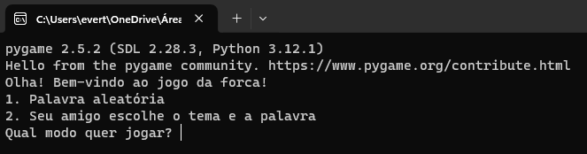

# Adivinhe a palavra
- [Adivinhe a palavra](#adivinhe-a-palavra)
  - [Sobre o jogo](#sobre-o-jogo)
  - [Como foi essa jornada?](como-foi-essa-jornada-?)
  - [Aperfeiçoamento](#aperfeiçoamento)
    - [Problemas](#problemas)
_____

## Sobre o jogo

Como devem imaginar, o jogador digita uma letra, e o Python revela a letra de acordo com a palavra escolhida (também há a opção de escolher o tema). Existem dois modos de jogar: alguém escolhendo o tema e a palavra, ou aleatoriamente.

Quando escolhe a opção de alguém escolher o tema e a palavra, ele pergunta quais vão ser e a o terminal, para que o segundo jogador não veja.

## Como foi essa jornada?

Para quem não me conhece, sou Hellen Cristina, tenho 18 anos e sou iniciante em programação. Criei este projeto após perguntar ao ChatGPT sobre projetos para iniciantes, e essa foi uma das sugestões. Depois disso, fui direto para o VS Code para tentar criar um algoritmo, com comentários. Foi aí que percebi a importância de elaborar um algoritmo primeiro no papel e desmembrá-lo cuidadosamente! Esse foi um dos meus erros. Pesquisei como fazer um menu, sobre a biblioteca random (pois eu sabia que o Random escolhia aleatoriamente números, mas não palavras), sobre dicionários (foi aí que percebi a importância deles e para que podem ser usados) e a biblioteca unidecode (que facilitou um dos meus maiores problemas neste projeto: os acentos!).

## Aperfeiçoamento

Depois de fazer toda a base do jogo, que era: pegar a letra, verificar se a letra está na palavra e mostrar a posição dela. Veio várias ideias de aperfeiçoamento, então vou conta-las e falar quais eu fiz.

| Número da Ideia | Sobre a Ideia                                      | Estado    | Nível de dificuldade (na minha opinião) |
|-----------------|-----------------------------------------------------|-----------|--------------------|
| 1               | Encerrar o jogo, quando acabar o número de chances | Concluído | Fácil |
| 2               | Fazer 2 modos no jogo(menu e escolha) | Concluído | Médio |
| 3               | Fazer o modo 2: aleatoriedade | Concluído | Díficil |
| 4               | Aceitar a letra, mesmo sem acento | Concluído | Díficil | 
| 5               | Fazer esse jogo em pygame | Em andamento | Médio |
| 6               | Printar a palavra no ínicio | Concluído | Fácil |
| 7               | Se escrever a tentativa for a palavra correta, encerrar | Em andamento | Médio |
| 8               | Não aceitar outros ints e mandar uma mensagem | Concluído | Médio |

## Problemas

A maior dificuldade que eu tive foi fazer o Python aceitar a palavra, mesmo que ela tenha acento. Por exemplo, se eu digitasse 'abóbora' e a tentativa fosse 'o', o programa deveria aceitar o 'ó' como correto e mostrá-lo.

Tanto, que ao perguntar a resolução da ideia no ChatGBT(se ele fosse iniciante), fiquei pensando "Eu dificultei uma tarefa simples", pois, ele me deu um jogo da forca, bem simples! E sem acentos, mesmo que as palavras deviam ter. Fiquei feliz e ao mesmo tempo triste kkkkkkk
Mas depois de perguntar em um fórum sobre uma resolução, conheci o unidecode e o switch, mas obtei pela opção mais rápida e simples, na minha opinião.

Obrigado por lerem!
